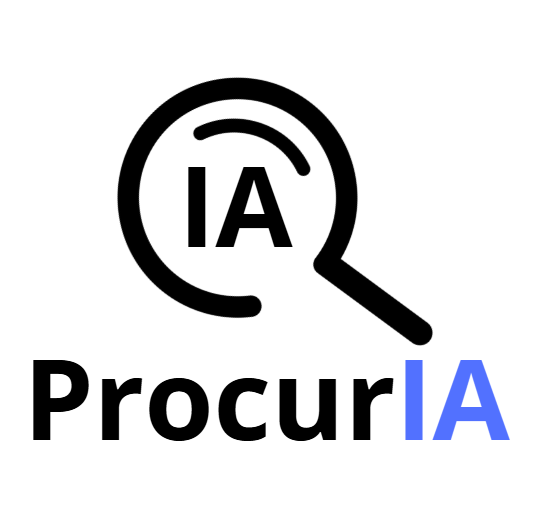

  

  

# ProcurIA

ProcurIA é um site dedicado a facilitar a pesquisa e descoberta de ferramentas de Inteligência Artificial (IA) voltadas para educação. Ele funciona como um catálogo interativo que ajuda estudantes, professores e pesquisadores a encontrar ferramentas de IA para aprendizado, pesquisa, escrita, design e muito mais.

Com uma interface intuitiva, o site oferece busca por nome, filtros por categoria, modais com detalhes das ferramentas e opções de compartilhamento, tornando a exploração de IAs acessível e prática.

---

## 🎯 Propósito

O objetivo do ProcurIA é simplificar o processo de encontrar ferramentas de IA úteis para fins educacionais. Seja para escrever textos acadêmicos, realizar pesquisas, criar apresentações ou gerar imagens, o site organiza uma coleção de ferramentas como ChatGPT, Midjourney, Granite, Microsoft Designer e outras, apresentando suas funcionalidades de forma clara e permitindo que os usuários as acessem rapidamente.

---

## ⚙️ Funcionalidades

- Catálogo de Ferramentas: Cards com ícones, descrições, links e ações interativas  
- Busca Inteligente: Pesquisa por nome ou palavras-chave  
- Filtros por Categoria: Chat, research, writing, tools  
- Modais de Detalhes: Exibição de descrição completa, funcionalidades e link  
- Compartilhamento: Links personalizados para cada ferramenta  
- Design Responsivo: Compatível com dispositivos móveis e desktops  
- Animações Visuais: Efeitos suaves em cards e ícones  

---

## 🛠️ Tecnologias Utilizadas

- HTML5  
- CSS3  
- JavaScript (Vanilla)  
- Font Awesome 6.4.0 (via CDN)  
- Markdown (para documentação)

---

## 📁 Estrutura do Projeto

- procuria/  
  - index.html  
  - README.md  
  - assets/ (imagens, ícones, recursos visuais)

---

## 🚀 Como Executar Localmente

1. Clone o repositório e acesse a pasta do projeto  
2. Abra o arquivo `index.html` em um navegador (clique duplo ou arraste para a janela do navegador)  
3. Alternativamente, execute um servidor local e acesse via `http://localhost:8000`

---

## 🌐 Dependências Externas

O site utiliza Font Awesome 6.4.0 via CDN. É necessário estar conectado à internet para carregar os ícones corretamente.

---

## 🤝 Como Contribuir

1. Faça um fork do repositório  
2. Crie uma branch para suas alterações  
3. Faça suas modificações (como adicionar uma nova ferramenta ou melhorar a interface)  
4. Envie um pull request com a descrição das mudanças

---

## ➕ Adicionando Novas Ferramentas

1. Adicione um novo card dentro da `
` no `index.html`  
2. Atualize o objeto `toolDetails` no JavaScript com os detalhes da ferramenta  
3. Teste localmente se o card aparece corretamente, a busca funciona e o modal exibe as informações certas

---

## 📄 Licença

Este projeto está licenciado sob a MIT License. Sinta-se à vontade para usar, modificar e distribuir o código conforme os termos da licença.

---

## 📬 Contato

Para sugestões, dúvidas ou feedback, crie uma issue no repositório ou entre em contato pelo e-mail: `seu-email@example.com`.

---

**ProcurIA – Encontre a IA perfeita para suas necessidades educacionais!**
